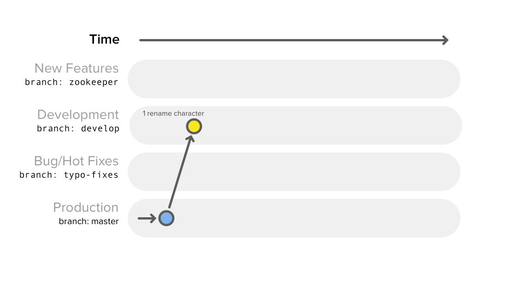
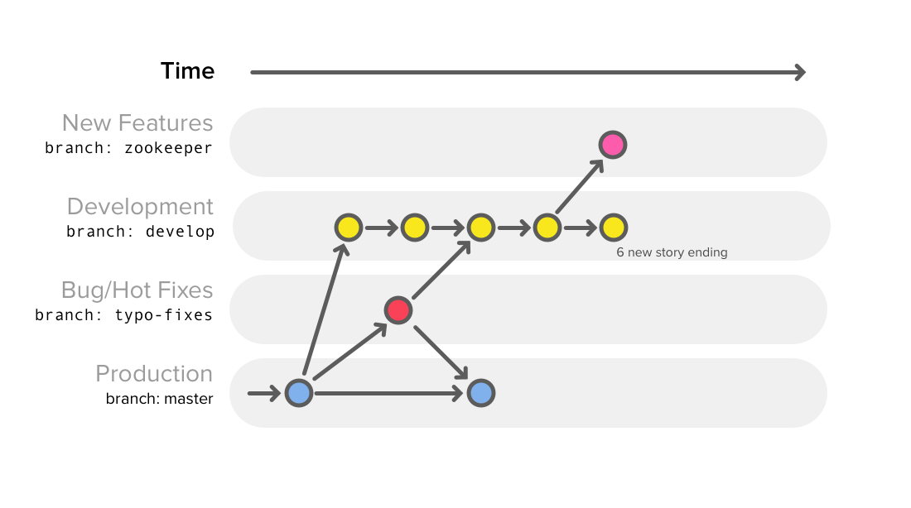
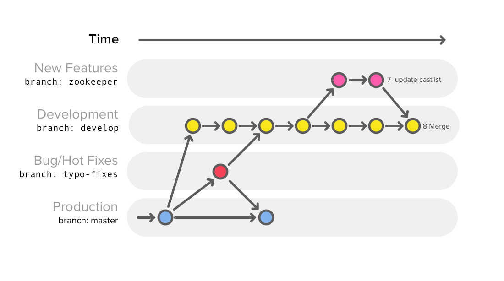

# Core-GitHub-3-Branching-and-Team-Workflows

Advanced GitHub for team work flows using branches to organize
shared projects.

For this lesson you will work alone, but imagine you are working 
with a group of other developers. Imagine each commit along 
the way as being added by a different member of the group. 

THe goal of the lesson is to show branching with Git and how you 
can use branching to manage a workflow that involves multiple
developers. 

## Overview

The Lab for this class is located [here](https://github.com/Product-College-Labs/Core-GitHub-Branching).

The material presented here is based on the article:
[A successful Git branching model](http://nvie.com/posts/a-successful-git-branching-model/).

This image shows the entires process outlined below. You could 
follow these processes in a real project. In the course of a 
project you might apply the steps outlined here several times. 

## Instructions

Imagine you are working on a screen play for a new movie. You 
need to fix problems in the script, add new features, merge
solve conflicts and publish the work along the way. 

### Rename character

The first step to create a new branch you can use to develop new 
features. It's important that the changes to this branch are 
not visible until they are considered ready to be published. 

Your goal: Create a new branch and rename the character.

- Create develop branch
- Checkout develop
- Edit text to rename the young boy "George"
- Commit

### Oh no! Fix typos

Sometimes your team will need to make changes to the existing 
published version of a product. 

- `checkout` master branch
- Edit text to fix typos
- Commit to
- Push to production (GitHub repo): `git push origin master`
- View script on GitHub to verify typos are fixed but young boy is not yet renamed

These changes should be incorporated into the developement branch. 

- Merge with develop

### New Feature: Add new characters

Sometimes your team will need to create a new feature. On larger 
teams it's safer to keep this out of the development branch until
the new feature is fully functioning. 

The producers have suggested that adding a zookeeper to the story 
would be a good idea. They may change their minds in the future. 
Probably best to keep this in a new feature branch. 

Add a character on a new feature branch.

- Be sure you're on the `develop` branch: `git status`
  - If not, run `git checkout develop`
- Create and checkout new branch: `git checkout -b zookeeper`
- Edit text to add the Zookeeper character to the plot
- Commit changes to `zookeeper` branch

### Improve story ending

The word from on top is that the ending is weak and needs work. 
You'll need to fix it. 

The ending is part of regular development your team is improving
something that is alread there. This work should be done on the 
development branch. 

- Checkout develop branch
- Edit text of last paragraph to improve the ending
- Commit

### Merge new character branches into develop

The new character ideas were approved! Be sure to proof read them
before merging them with main story under developement. 

- Be sure you're on the `develop` branch
- Merge `koala` branch into `develop`: `git merge koala`
- Now, the ending doesn't include the new character! Add another sentence to include the Friendly Koala in the ending

### Review new script and ship it!
    - Be sure you're on the `develop` branch
    - Code review (read the script once through to catch any errors)
    - If all looks good, ship it! `git push origin master`

